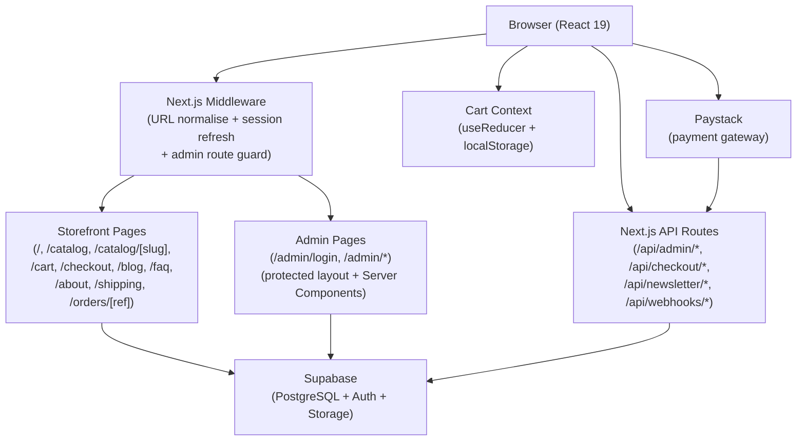

<!-- generated-by: gsd-doc-writer -->
# Architecture

## System overview

Twinkle Locs is a Nigerian loc bead e-commerce storefront built on Next.js 15 (App Router) with Supabase as its backend-as-a-service. The system accepts product browsing and purchase requests from anonymous shoppers, processes payments through Paystack, and records confirmed orders via a signed webhook. An authenticated admin panel allows the store owner to manage products, orders, blog posts, FAQs, and site settings. The architecture follows a layered pattern: a React/Tailwind presentation layer, a set of Next.js API routes for mutation logic, and Supabase (PostgreSQL + Auth + Storage) as the persistence and identity layer.

---

## Component diagram



---

## Data flow

### Shopper purchase flow

1. The shopper browses `/catalog` — the page Server Component fetches active products directly from Supabase using the server client (`src/lib/supabase/server.ts`).
2. The shopper adds a product to their cart. `CartContext` (a `useReducer`-based React context in `src/lib/cart/CartContext.tsx`) updates client-side state and persists cart items to `localStorage` under the key `twinkle_cart`.
3. On the checkout page (`/checkout`), the shopper fills in delivery details. Before payment is initiated, the form calls `POST /api/checkout/save-intent` which writes an `abandoned_orders` row to Supabase for recovery tracking.
4. The shopper clicks Pay. The Paystack Inline JS widget opens. Metadata (cart items, customer details, shipping) is embedded in the Paystack charge.
5. On payment success, Paystack fires a `charge.success` webhook to `POST /api/webhooks/paystack`. The handler verifies the HMAC-SHA512 signature using `PAYSTACK_SECRET_KEY`, then writes an `orders` row and related `order_items` rows using the Supabase service role client. It also marks any matching `abandoned_orders` row as recovered.
6. The shopper is redirected to `/orders/[reference]`. `OrderPoller` (a client component) subscribes to a Supabase Realtime channel on the `orders` table filtered by `paystack_reference`. Once the row appears it renders `OrderConfirmationView`.

### Admin flow

1. The store owner visits `/admin/login`. Credentials are submitted via a Next.js Server Action (`src/app/(admin)/admin/login/actions.ts`) which calls `supabase.auth.signInWithPassword`.
2. Next.js middleware on every subsequent `/admin/*` request calls `supabase.auth.getUser()` (server-validated, not just JWT) and redirects to `/admin/login` if no session exists. The protected layout performs an additional `getUser()` check as a defence-in-depth measure against CVE-2025-29927.
3. Admin mutations (create/update/delete products, orders, blog posts, FAQs, settings, shipping, reviews) hit `/api/admin/*` routes. Each route re-validates the session using the server client before delegating writes to the service role admin client (`src/lib/supabase/admin.ts`).

---

## Key abstractions

| Abstraction | File | Description |
|---|---|---|
| `CartProvider` / `useCart` | `src/lib/cart/CartContext.tsx` | React context wrapping `cartReducer`; exposes `state` and `dispatch` to the tree; persists items to `localStorage` |
| `cartReducer` | `src/lib/cart/cartReducer.ts` | Pure reducer handling `HYDRATE`, `ADD_ITEM`, `UPDATE_QTY`, `REMOVE_ITEM`, `CLEAR_CART`, `OPEN_DRAWER`, `CLOSE_DRAWER`; keyed on `productId:variantId:tierQty:threadColour` |
| `createClient` (server) | `src/lib/supabase/server.ts` | Returns a Supabase SSR client scoped to the current request's cookies; safe for Server Components and API routes |
| `createClient` (browser) | `src/lib/supabase/client.ts` | Returns a Supabase browser client for client components such as `OrderPoller` |
| `createAdminClient` | `src/lib/supabase/admin.ts` | Returns a service-role Supabase client for privileged writes; must never be imported in client components |
| `getShippingCost` | `src/lib/checkout/shipping.ts` | Pure function: Lagos → ₦3,000; all other Nigerian states → ₦4,500 |
| `Database` | `src/types/supabase.ts` | Manually maintained TypeScript type map of all Supabase tables (`products`, `reviews`, `orders`, `order_items`, `settings`, `about_sections`, `faqs`, `blog_posts`, `abandoned_orders`, `newsletter_subscribers`) |
| `Product` / `ProductVariant` / `PriceTier` | `src/lib/types/product.ts` | Domain types for the tiered-price product model; `PriceTier` pairs a pack size (`qty`) with a Naira price |
| `BUSINESS` | `src/lib/config/business.ts` | Single source of truth for WhatsApp number, Instagram handle, and support email |
| `middleware` | `middleware.ts` | Runs on every non-static request: lowercases URLs for SEO, refreshes the Supabase session, and guards `/admin/*` routes |

---

## Directory structure rationale

```
twinkle/
├── middleware.ts           # Edge middleware: URL normalisation, session refresh, admin guard
├── next.config.ts          # Next.js config — remote image patterns (Supabase Storage)
├── supabase/
│   └── migrations/         # SQL migration files applied via Supabase CLI or Dashboard
├── src/
│   ├── app/                # Next.js App Router — all routes live here
│   │   ├── (admin)/        # Route group for /admin pages (separate layout, no storefront chrome)
│   │   │   ├── _components/    # Admin-only UI components (forms, tables, sidebar)
│   │   │   └── admin/          # /admin/login and /admin/(protected)/* pages
│   │   ├── api/            # Next.js API Route handlers (mutations + webhooks)
│   │   │   ├── admin/          # Admin CRUD endpoints (auth-gated)
│   │   │   ├── checkout/       # Abandoned order capture
│   │   │   ├── newsletter/     # Newsletter subscription
│   │   │   └── webhooks/       # Paystack charge.success webhook
│   │   └── (storefront pages)  # catalog, cart, checkout, orders, blog, faq, about, shipping
│   ├── components/         # Shared React components, co-located by feature
│   │   ├── cart/           # CartDrawer, CartLineItem
│   │   ├── checkout/       # CheckoutForm, OrderReview, PaystackButton
│   │   ├── home/           # Hero, FeaturedProducts, BrandStory, Testimonials, InstagramCTA
│   │   ├── catalog/        # CatalogClient, FilterBar, FilterDrawer, SearchInput
│   │   ├── product/        # ProductDetailClient, ImageGallery, Reviews, RelatedProducts, UpsellBlock
│   │   ├── layout/         # StorefrontChrome, Header, Footer, MobileDrawer, NewsletterForm
│   │   ├── about/          # AboutSection, AboutStickyNav
│   │   ├── blog/           # BlogPostCard, BlogCategoryFilter, BlogShareButtons
│   │   ├── faq/            # FaqAccordion
│   │   └── ui/             # Primitive UI components (buttons, modals, etc.)
│   ├── lib/                # Non-component logic
│   │   ├── cart/           # CartContext, cartReducer, cart types
│   │   ├── checkout/       # Shipping zone logic
│   │   ├── config/         # Business constants (BUSINESS object)
│   │   ├── mock/           # Static mock data (products, testimonials) used during development
│   │   ├── supabase/       # Supabase client factories (server, client, admin)
│   │   └── types/          # Domain type definitions (product, review)
│   └── types/
│       └── supabase.ts     # Full Database type map for Supabase codegen compatibility
```

### Why this structure

- **Route groups `(admin)` and `(shop)`/`(marketing)`** — keep the admin layout (full-screen dark sidebar) completely separate from the storefront chrome (header + footer) without URL path changes.
- **`_components/` inside `(admin)`** — admin UI components are private to the admin route group and cannot be accidentally imported by storefront pages.
- **`lib/` vs `components/`** — pure logic (reducers, Supabase factories, shipping rules, config) is kept out of the component tree so it can be tested or reused independently.
- **`lib/mock/`** — static data used on the homepage (featured products, testimonials) until CMS-driven content replaces it, isolating the coupling point.
- **`supabase/migrations/`** — SQL migrations are version-controlled alongside the application code rather than applied ad-hoc through the Dashboard.
